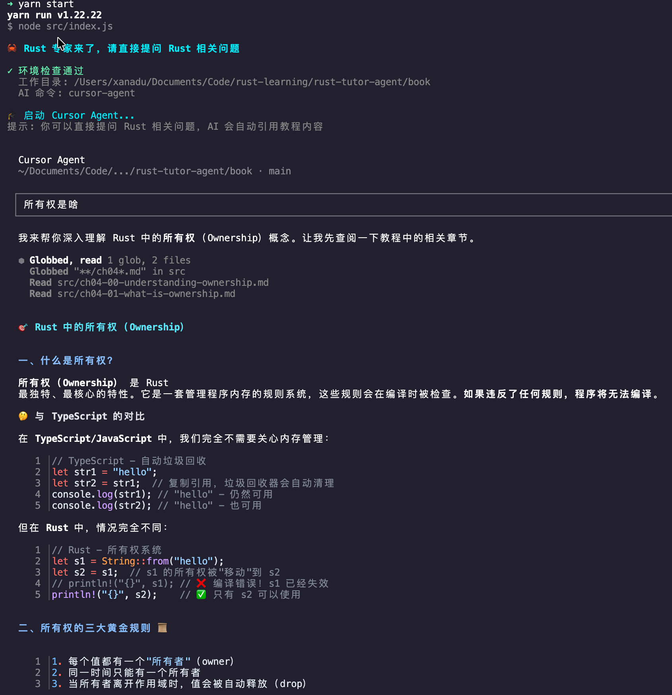

# 🦀 Rust Tutor Agent

基于 Cursor CLI 和 Rust 官方教程的 Rust 专家，可以为你解答任何关于 Rust 的疑问。

## 📸 截图



## ✨ 特性

- 🤖 基于 Cursor AI 的智能问答
- 📚 自动引用 Rust 官方教程内容
- 🔄 自动管理教程仓库（克隆/更新）
- ⚡ 浅克隆模式，快速下载官方教程
- 🎨 友好的终端交互界面
- ⚙️ 灵活的配置选项

## 🚀 快速开始

### 方式一：全局安装（推荐）

```bash
# 1. 全局安装
npm install -g @ksxz/rust-tutor

# 2. 初始化环境
rust-tutor setup

# 3. 开始提问
rust-tutor
```

### 方式二：本地使用

```bash
# 1. 克隆项目
git clone git@ksogitlab.wps.kingsoft.net:inner-source/individual/rust_tutor.git
cd rust-tutor

# 2. 初始化
npm run setup

# 3. 开始学习
npm start
```

### 初始化说明

首次使用需要运行初始化命令，这个命令会：

- ✅ 检测并安装 Cursor CLI（如果需要）
- 📥 克隆 Rust 官方教程仓库（使用 `--depth=1` 浅克隆）
- 📋 配置 AI 导师规则
- 🔄 如果已存在则自动更新

### 开始学习

```bash
# 全局安装后
rust-tutor              # 或 rust-tutor ask

# 本地使用
npm start
```

启动后你可以：

- 💬 直接提问任何 Rust 相关问题
- 📖 AI 自动引用教程章节内容
- 🤖 基于 `.cursorrules` 的专业 Rust 导师
- 🎯 使用 TypeScript 类比帮助理解

### 更新教程

```bash
# 全局安装
rust-tutor update

# 本地使用
npm run update
```

## 📦 命令列表

### 全局命令（安装后）

| 命令                | 说明                       |
| ------------------- | -------------------------- |
| `rust-tutor`        | 启动 Rust 专家（默认命令） |
| `rust-tutor ask`    | 启动 Rust 专家（同上）     |
| `rust-tutor setup`  | 初始化环境                 |
| `rust-tutor update` | 更新教程                   |
| `rust-tutor help`   | 显示帮助信息               |

### 本地命令（开发）

| 命令             | 说明                                           |
| ---------------- | ---------------------------------------------- |
| `npm run setup`  | 初始化环境（检测 Cursor CLI + 克隆/更新 book） |
| `npm run update` | 更新 Rust 官方教程                             |
| `npm start`      | 启动交互式学习助手                             |

## ⚙️ 配置

项目支持灵活的配置方式，详见 [CONFIG.md](./CONFIG.md)。

### 快速配置

通过环境变量自定义：

```bash
# 使用镜像仓库
export RUST_BOOK_GIT_URL=""

# 自定义目录
export RUST_BOOK_PATH="/path/to/your/book"

# 自定义 Cursor 命令
export CURSOR_COMMAND="cursor-agent"

npm run setup
```

或直接修改 `src/config.js`。

### 默认配置

- **Git 仓库**: `https://github.com/rust-lang/book.git`
- **Book 目录**: `./book`
- **Cursor 命令**: `cursor`
- **克隆深度**: `1`（浅克隆，快速下载）

## 💡 使用技巧

### 提问技巧

- ✅ 具体明确："什么是所有权？"
- ✅ 关联学习："Rust 的 Result 和 TypeScript 的联合类型有什么关系？"
- ✅ 深入探讨："为什么需要生命周期标注？"
- ✅ 代码调试："这段代码为什么编译失败？"

AI 会自动查找 `src/` 目录下的相关章节并给出详细解答。

### Cursor Agent 功能

- 📝 多轮对话，保持上下文
- 🔍 自动搜索相关教程文件
- 💡 提供代码示例和解释
- 🎓 TypeScript 背景友好的类比讲解

## 📁 项目结构

```text
rust-tutor/
├── bin/
│   └── rust-tutor.js     # 全局 CLI 入口
├── src/
│   ├── config.js         # 配置文件（统一管理所有配置）
│   ├── book-manager.js   # Book 仓库管理模块（克隆/更新逻辑）
│   ├── cursor-cli.js     # Cursor CLI 管理模块（检测/安装逻辑）
│   ├── setup.js          # 初始化脚本（组合 CLI + Book）
│   ├── update-book.js    # 更新脚本（复用 book-manager）
│   └── index.js          # 主程序（启动 cursor-agent）
├── .cursorrules          # AI 导师规则配置
├── package.json
└── README.md
```

### 数据目录

**全局安装时：**

- Book 目录：`~/.rust-tutor/book`
- 配置文件：`~/.rust-tutor/book/.cursorrules`

**本地使用时：**

- Book 目录：`./book`
- 配置文件：`./book/.cursorrules`

### 模块化设计

- **config.js**: 统一的配置管理，支持环境变量
- **book-manager.js**: Book 仓库操作的核心逻辑
  - `checkBookDirectory()` - 检查目录
  - `cloneRustBook()` - 克隆仓库
  - `updateRustBook()` - 更新仓库
  - `copyCursorRules()` - 复制配置文件
  - `syncRustBook()` - 智能同步（克隆或更新）
- **cursor-cli.js**: Cursor CLI 管理
  - `commandExists()` - 检查命令
  - `checkCursorCLI()` - 检查安装
  - `installCursorCLI()` - 安装 CLI
  - `ensureCursorCLI()` - 确保已安装
- **setup.js**: 完整初始化流程
- **update-book.js**: 仅更新 Book（复用 book-manager）
- **index.js**: 主程序，在 book 目录下启动 cursor-agent

## 🔧 系统要求

- Node.js 14+
- Git
- Cursor IDE（会自动安装 Cursor CLI）
- macOS/Linux（Windows 需要 WSL）

## 📦 安装方式

### 从 npm 安装（推荐）

```bash
npm install -g @ksxz/rust-tutor
```

### 从源码安装

```bash
git clone git@ksogitlab.wps.kingsoft.net:inner-source/individual/rust_tutor.git
cd rust-tutor
npm install -g .
```

### 本地开发

```bash
git clone git@ksogitlab.wps.kingsoft.net:inner-source/individual/rust_tutor.git
cd rust-tutor
npm install
npm run setup
```

## 📝 工作原理

1. **初始化阶段** (`rust-tutor setup`)

   - 检测并安装 Cursor CLI（如需要）
   - 克隆 Rust 官方教程仓库（使用 `--depth=1` 浅克隆）
   - 复制 `.cursorrules` 到 book 目录

2. **学习阶段** (`rust-tutor` 或 `rust-tutor ask`)

   - 在 book 目录下启动 `cursor-agent`
   - AI 基于 `.cursorrules` 扮演 Rust 导师角色
   - 自动访问 `src/` 下的所有教程章节
   - 提供准确、详细的回答

3. **更新阶段** (`rust-tutor update`)
   - 更新教程内容到最新版本
   - 重新复制 `.cursorrules` 配置

## 🌟 特色功能

### 浅克隆（--depth=1）

使用浅克隆大幅减少下载时间和磁盘占用：

- ⚡ 速度提升：只下载最新提交
- 💾 空间节省：不包含完整历史
- 🎯 满足需求：学习使用已经足够

如需完整历史，可修改配置文件。

### 智能引用

基于 `.cursorrules` 配置，AI 会自动：

- 🔍 搜索 `book/src/` 下的相关章节（ch\*.md）
- 📌 引用具体文件名和章节号
- 📚 在回答末尾列出参考资料
- ✅ 确保回答基于官方教程内容

### TypeScript 类比

针对有 TypeScript 背景的学习者：

- 对比 Rust 和 TypeScript 的概念
- 利用已有知识快速理解新概念
- 突出 Rust 的独特特性

## 🤝 贡献

欢迎提交 Issue 和 Pull Request！

## 📄 许可

MIT License

## 🔗 相关链接

- [安装指南](./INSTALL.md) - 详细安装说明
- [Rust 官方教程](https://doc.rust-lang.org/book/)
- [Rust 官方网站](https://www.rust-lang.org/)
- [Cursor IDE](https://cursor.com/)
- [GitHub 仓库](https://github.com/your-username/rust-tutor)
