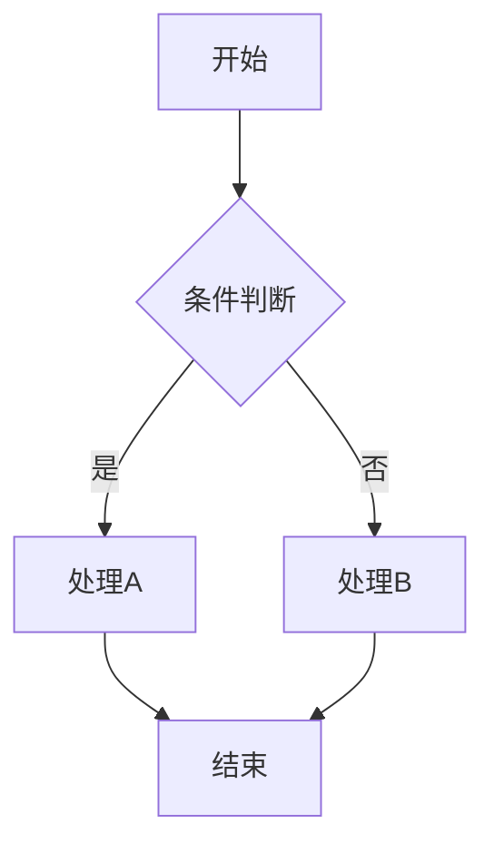
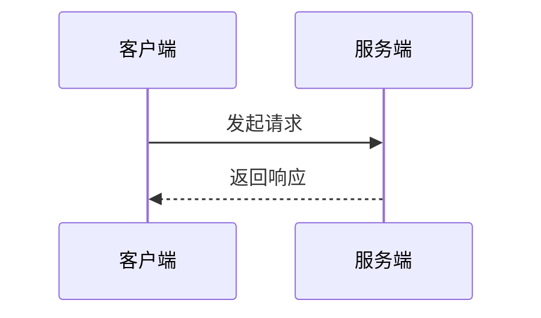
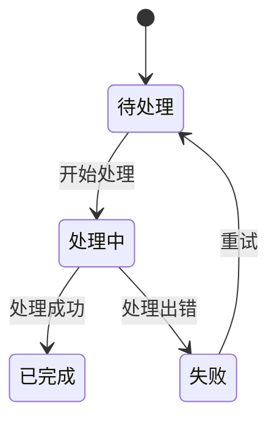

# 技术方案文档生成

## 概述

根据用户提供的需求信息，生成标准化的前端技术方案文档。输出为 Markdown 文件，直接存放在**用户当前项目根目录**。流程图、架构图优先使用 **mermaid** 语法。

## 工作流

```
Task Progress:
- [ ] Step 1: 收集需求信息
- [ ] Step 2: 分析需求，确定方案结构
- [ ] Step 3: 按模板生成技术方案文档
- [ ] Step 4: 输出到项目根目录
```

### Step 1: 收集需求信息

向用户确认以下关键信息（已有则跳过）：

1. **需求名称**：用于文档标题和文件名
2. **需求背景**：为什么要做这个功能
3. **需求概述**：做什么、核心功能点
4. **需求文档链接**（可选）：PRD、设计稿等
5. **相关人员**：产品、开发、测试、运维
6. **技术约束**：平台限制、性能要求、兼容性要求等

### Step 2: 分析需求

根据收集的信息：

1. 梳理功能要点和影响范围
2. 识别技术难点，需要技术预研的点
3. 规划整体架构和详细设计
4. 评估外部依赖、安全风险、成本

### Step 3: 按模板生成文档

严格遵循模板结构（见 [references/reference.md](references/reference.md)），生成完整技术方案。

**关键规则：**

- 文件格式：Markdown（`.md`）
- 文件命名：`tech-design-【功能名称】.md`
- 存放位置：项目根目录
- 流程图/架构图：使用 mermaid 语法
- 标记可选章节：无内容的可选章节保留标题并标注"（暂无）"
- 术语表：涉及专业术语时必须填写
- 代码示例：关键数据结构和接口定义需给出代码示例

### Step 4: 输出文件

将文档写入项目根目录，告知用户文件路径。

## 模板结构速览

```
# 【前端/后端】功能名称

## 一、变更记录
## 二、任务排期规划（可选）
## 三、业务背景简介
  ### 3.1 需求背景
  ### 3.2 需求概述
  ### 3.3 相关人员
  ### 3.4 其他相关资料
## 四、功能要点
## 五、影响范围
## 六、方案设计
  ### 6.1 术语表
  ### 6.2 技术预研
  ### 6.3 总体设计
  ### 6.4 详细设计
  ### 6.5 持久化/缓存（可选）
  ### 6.6 关键测试点
  ### 6.7 发布计划（可选）
  ### 6.8 备选方案（可选）
## 七、外部依赖资源
## 八、安全风险评估
## 九、其他重点问题
  ### 9.1 系统扩展性
  ### 9.2 系统兼容性
  ### 9.3 系统可用性（必填）
  ### 9.4 系统可靠性
## 十、成本和收益
## 十一、FAQ
## 十二、评审记录
## 十三、风险点
## 十四、附录
```

## mermaid 使用指引

流程图、时序图、架构图等优先使用 mermaid，常用类型：

**流程图**（适用于数据流转、业务流程）：
````markdown

````

**时序图**（适用于模块间交互、接口调用）：
````markdown

````

**状态图**（适用于状态机、生命周期）：
````markdown

````

## 额外资源

- 完整模板和填写说明：[references/reference.md](references/reference.md)
