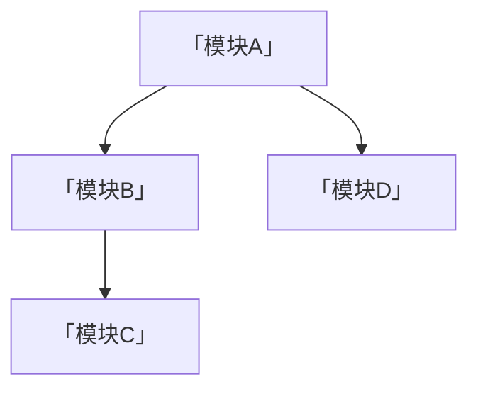
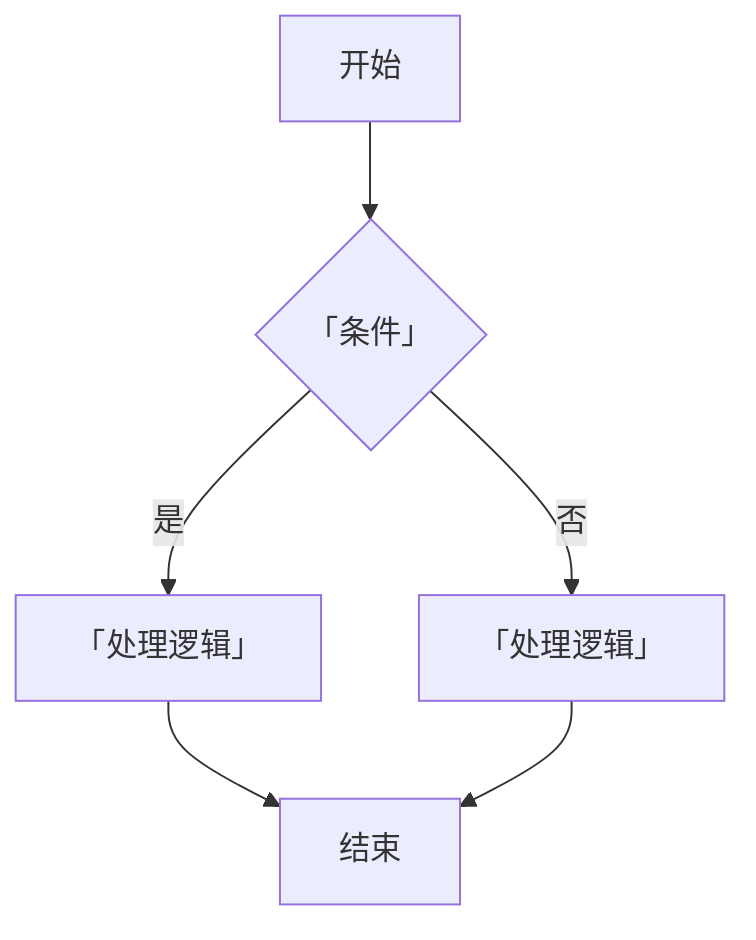

# 技术方案文档模板 v1.0.0

> 本文件为完整模板参考，包含每个章节的说明和示例。
> 来源：[技术方案模板](https://365.kdocs.cn/l/cmm5S6lFiun2)

---

以下为完整模板，可直接复制使用。`「」` 内的内容为填写说明，生成时替换为实际内容。

---

```markdown
# 【前端/后端】「功能名称」

## 一、变更记录

> 技术方案文档需要严格管控变更记录，记录关键性的变更内容和审核意见。

| **文档版本** | **变更人** | **变更时间** | **变更日志** |
| ------------ | ---------- | ------------ | ------------ |
| v1.0         | 「姓名」   | 「日期」     | 初稿         |

## 二、任务排期规划（可选）

| **时间节点** | **任务期数** | **负责人** | **任务内容**（按功能模块拆分） | **工作量预估** | **备注** |
| ------------ | ------------ | ---------- | ---------------------------- | -------------- | -------- |
| 「日期」     | 第一期       | 「姓名」   | 「具体任务内容」               | 「N 人天」     | -        |

## 三、业务背景简介

### 3.1 需求背景

「描述为什么要做这个功能，解决什么问题，用户痛点是什么。」

### 3.2 需求概述

「简要说明功能做什么，核心能力是什么。」

| **类型**       | **文档信息**                |
| -------------- | -------------------------- |
| **需求等级**   | 「S/A/B/C」                |
| **需求文档**   | [「需求名称」](「链接」)   |
| **设计稿**     | 「链接或"无"」             |
| **后端方案**   | 「链接或"无"」             |
| **接口文档**   | 「链接或"无"」             |
| **测试用例文档** | 「链接或"无"」           |
| **任务链接**   | 「ONES/JIRA 链接或"无"」  |

### 3.3 相关人员

| **职能** | **人员**     | **职责**         |
| -------- | ------------ | ---------------- |
| **产品** | 「@姓名」    | 「需求对接」     |
| **开发** | 「@姓名」    | 「具体分工」     |
| **测试** | 「@姓名」    | 「测试范围」     |
| **运维** | 「@姓名」    | 「运维协作」     |

### 3.4 其他相关资料

- 「列举参考文档、竞品分析、历史方案等」

## 四、功能要点

「用列表或表格梳理核心功能点，每个功能点一句话说清楚做什么。」

1. 「功能点 1」
2. 「功能点 2」
3. 「功能点 3」

## 五、影响范围

「列举本次改动影响的模块、页面、接口、组件等。」

1. 「影响范围 1」
2. 「影响范围 2」

## 六、方案设计

### 6.1 术语表

> 当方案涉及专业术语、项目特定概念时必须填写。

| **术语名称** | **解释说明**       | **备注** |
| ------------ | ------------------- | -------- |
| 「术语」     | 「解释」            | -        |

### 6.2 技术预研

> 对方案中涉及的关键技术难点进行预研和论证。
> 每个预研点独立为一个子章节，包含：问题描述、调研过程、结论。

#### 6.2.1 「预研点标题」

**问题**：「描述需要预研的技术问题」

**调研**：「调研过程和数据」

**结论**：「最终选择的方案及理由」

### 6.3 总体设计

> 用架构图或流程图展示系统整体设计，使用 mermaid 语法。



「补充架构说明文字」

### 6.4 详细设计

> 按功能模块拆分，每个模块一个子章节。
> 每个模块包含：功能描述、流程图/时序图、关键数据结构、接口定义。

#### 6.4.1 「模块名称」

**功能描述**：「说明该模块的职责」

**流程图**：



**关键数据结构**：

```typescript
interface 「InterfaceName」 {
  id: string;
  // 「字段说明」
}
```

#### 6.4.2 「模块名称」

「同上结构」

### 6.5 持久化/缓存（可选）

> 涉及本地存储、缓存策略、数据持久化时填写。

「描述持久化方案、缓存策略、数据恢复机制等」

### 6.6 关键测试点

> 列举需要重点测试的场景。

1. **「测试类型」**
   - 「具体测试场景」
   - 「预期结果」

2. **「测试类型」**
   - 「具体测试场景」

### 6.7 发布计划（可选）

> 整理本方案关联的特殊发布流程规划。
> 重点整理历史兼容操作流程、新增外部依赖关联环节等。

### 6.8 备选方案（可选）

> 提供常规方案受阻后的备选方案、兜底方案、回滚策略等。

**应急方案设计**：
- 动态变更方案（配置开关、版本控制、动态策略等）
- 线上回滚策略

## 七、外部依赖资源

**资源类（前置资源卡点型）**：

| **依赖模块** | **依赖说明** | **版本** | **备注**        |
| ------------ | ------------ | -------- | --------------- |
| 「模块名」   | 「说明」     | 「版本」 | 「交付时间等」  |

**三方资源类（引入的三方资源型）**：

| **依赖包**   | **依赖说明** | **版本** | **备注** |
| ------------ | ------------ | -------- | -------- |
| 「包名」     | 「说明」     | 「版本」 | -        |

## 八、安全风险评估

> 评估方案涉及的安全风险，包括但不限于：
> - 数据安全（用户数据保护、敏感信息脱敏/加密）
> - XSS/CSRF 防护
> - 接口鉴权
> - 日志脱敏

「具体安全风险及应对策略」

## 九、其他重点问题

### 9.1 系统扩展性

「说明系统的扩展能力，模块化设计，是否可复用」

### 9.2 系统兼容性

「说明需要兼容的浏览器、操作系统、设备等」

### 9.3 系统可用性（必填）

「说明系统的可用性设计，降级策略、容错机制等」

### 9.4 系统可靠性

「说明系统的可靠性保障，异常处理、数据恢复等」

## 十、成本和收益

| **维度** | **评估** |
| -------- | -------- |
| **成本** | 人力成本：「N 人天」；其他成本：「IDC/存储/模型调用等」 |
| **收益** | 用户价值：「描述」；业务收益：「描述」 |

**人力成本明细**：

| **人员** | **任务模块** | **工时** |
| -------- | ------------ | -------- |
| 「@姓名」 | 「模块 1」  | 「Nd」   |
| 「@姓名」 | 「模块 2」  | 「Nd」   |
| **总工时** |              | 「Nd」   |

## 十一、FAQ

> 列举读者可能提出的问题并准备好答案，数量控制在 10 个以内。

**Q1**: 「问题」
**A1**: 「回答」

**Q2**: 「问题」
**A2**: 「回答」

## 十二、评审记录

> 记录评审详情并在相关群内同步结论。

| **评审范围**   | **评审详情** |
| -------------- | ------------ |
| **内审**       | **评委列表** |
| **评审时间**   | 「时间」     |
| **评审结果**   | 「通过/不通过/有条件通过」 |
| **主要评审意见** | 「意见」   |

## 十三、风险点

1. 「风险点 1：描述风险及影响」
2. 「风险点 2：描述风险及影响」

## 十四、附录

「参考资料、外部链接、补充说明等」
```

---

## 章节填写指南

### 必填章节

以下章节为必填，即使内容简单也需要填写：

| 章节 | 说明 |
|------|------|
| 变更记录 | 至少有初稿版本记录 |
| 业务背景简介 | 需求背景、概述、相关人员 |
| 功能要点 | 核心功能列表 |
| 影响范围 | 改动影响的范围 |
| 方案设计 | 总体设计 + 详细设计 |
| 外部依赖资源 | 无依赖时标注"无" |
| 安全风险评估 | 无风险时说明原因 |
| 系统可用性 | 9.3 为必填 |
| 成本和收益 | 至少有人力成本 |
| 评审记录 | 待评审时留空表格 |

### 可选章节

以下章节根据实际情况决定是否填写：

| 章节 | 何时填写 |
|------|----------|
| 任务排期规划 | 有明确排期时 |
| 术语表 | 涉及专业术语/特定概念时 |
| 技术预研 | 有技术不确定性需调研时 |
| 持久化/缓存 | 涉及本地存储或缓存时 |
| 发布计划 | 有特殊发布流程时 |
| 备选方案 | 主方案有风险需兜底时 |
| FAQ | 预期有常见问题时 |

### 图表使用建议

| 场景 | 推荐图表类型 |
|------|-------------|
| 系统整体架构 | mermaid flowchart |
| 模块间数据流转 | mermaid flowchart TD/LR |
| 模块间交互时序 | mermaid sequenceDiagram |
| 状态变化 | mermaid stateDiagram-v2 |
| 对比选型 | Markdown 表格 |
| 数据结构 | TypeScript interface / 代码块 |
| 时间线规划 | mermaid gantt |
